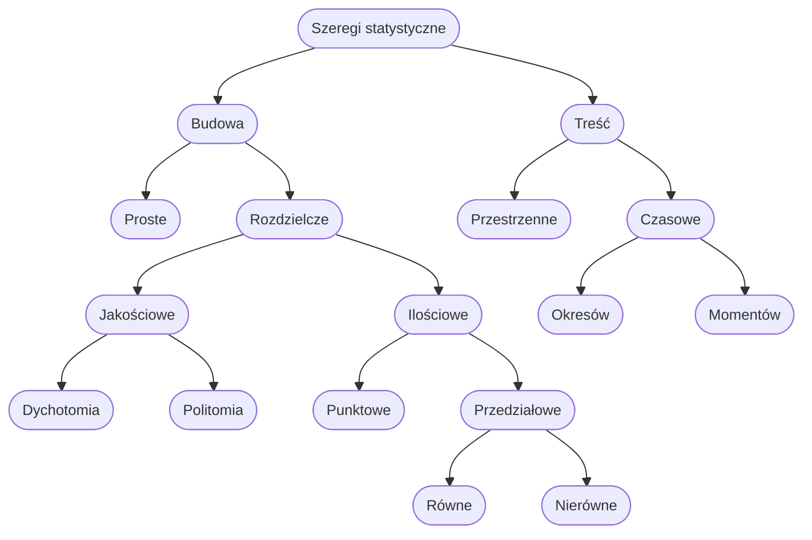

#### Zbiorowość statystyczna 
- Zbiór elementów (osób, przedmiotów, zdarzeń) podobnych, lecz nie identycznych względem określonej cechy, będący przedmiotem badania statystycznego. Precyzyjna definicja zbiorowości statystycznej wymaga odpowiedzi na trzy pytania: Kto, co? Gdzie? Kiedy?
#### Jednostka statystyczna 
- Najmniejszy niepodzielny element zbiorowości statystycznej.
#### Cecha statystyczna
- Właściwość zbiorowości, która jest przedmiotem badania statystycznego. Zgodnie z definicją cecha statystyczna jest to funkcja przypisująca jednostkom zbiorowości statystycznej elementy zbioru wartości cechy statystycznej.
- **Cechy określające** zbiorowość statystyczną: rzeczowe, czasowe, przestrzenne
- **Cechy zmienne**: Ilościowe (ciągłe, skokowe), Jakościowe (dychotomia, politomia)

Populacja -> (Losowanie) -> Próba -> (Wnioski) -> Populacja (zatacza się)
#### Zjawisko masowe - Prawo wielkich liczb
- Przy masowym powtarzaniu się badanych zdarzeń ma miejsce kompensowanie się skutków związków przypadkowych (ubocznych) i uwidacznianie się związków głównych - podstawowych.
- **Przyczyny główne** (składnik systematyczny): wspólne wszystkim jednostkom badanej zbiorowości, mające charakter wewnętrzny, działające w ściśle określonym kierunku
- **Przyczyny uboczne** (składnik losowy): mają charakter zewnętrzny, działają w różnym kierunku, zaciemniają obraz zjawiska, utrudniają wykrycie prawidłowości
#### Klasyfikacja badań statystycznych
1. **Ze względu na zakres**: pełne, częściowe
2. **Ze względu na czas**: ciągłe, okresowe, doraźne
#### Operator losowania
- **Operat losowania** - wykaz wszystkich jednostek badanej zbiorowości statystycznej. 
- Jeżeli dobieramy próbę w procesie losowania wieloetapowego na każdym etapie losowania potrzebny jest operat losowania!
- Własności operatu losowania: **kompletność** (tzn. operat losowania powinien obejmować wszystkie jednostki badanej populacji, przy czym każda jednostka badania powinna w nim figurować tylko raz), **aktualność**
#### Relacja między populacją generalną a próbą
Populacja -> (Losowanie) -> Próba -> (Wnioski statystyczne) -> Populacja (zatacza się)
#### Systematyka procesu losowego doboru próby 
- **I Losowanie jednoetapowe**
- **II Losowanie wieloetapowe**
1. **Losowanie I-szego stopnia** - Tworzymy zespołowe jednostki losowania tzn. jednostki losowania pierwszego stopnia, losujemy pewną liczbę tych jednostek.
2. **Losowanie II-tego stopnia** - Jednostki wylosowane w losowaniu I-stopnia dzielimy na mniejsze jednostki zespołowe (lub indywidualne - jeśli jest to ostatni stopień losowania), losujemy pewną liczbę tych jednostek.
- **I Losowanie Zespołowe**
- **II Losowanie indywidualne**
- **I Losowanie nieograniczone** - jeżeli wylosowanie do próby pewnej jednostki losowania, bądź pewnych jednostek losowania nie ogranicza możliwości wylosowania innej bądź innych jednostek losowania pod warunkiem, że łączna liczba tych jednostek nie przekracza łącznej liczby jednostek, jaka może być w próbie
- **II Losowanie ograniczone** - jeżeli wylosowanie do próby pewnej jednostki bądź pewnych jednostek uniemożliwia równoczesne wylosowanie jakiejś, bądź jakichś jednostek losowania.
  ###### Przykłady losowania ograniczonego:
- **Losowanie warstwowe** - przed przystąpieniem do losowania (danego stopnia) dzielimy jednostki losowania na warstwy w taki sposób, że każda jednostka losowania należy do jednej i tylko jednej warstwy. Następnie losujemy próbę z każdej warstwy.
- **Losowanie systematyczne** - po uporządkowaniu jednostek losowania w pewnej kolejności losujemy k-jednostek (k - interwał losowania) jedną jednostkę losowania. Do próby wchodzą te jednostki losowania, które są oddalone od pierwszej o wielokrotność k.
- **I Losowanie niezależne (ze zwracaniem)** - Ta sama jednostka może być wylosowana do próby dwukrotnie lub nawet więcej razy
- **II Losowanie zależne (bez zwracania)** - Prawdopodobieństwa wylosowania do próby zmieniają się w miarę losowania kolejnych jednostek do próby.
- **I Losowanie próby z jednakowym prawdopodobieństwem wyboru**
- **II Losowanie próby z różnym prawdopodobieństwem wyboru**
#### Etapy badania statystycznego
1. Programowanie badania
- **Określenie celów badania** (ogólne i szczegółowe (hipotezy robocze))
- **Określenie przedmiotu badania** (Definicja zbiorowości i jednostki statystycznej)
- **Określenie zakresu badania** (cechy ilościowe i jakościowe)
- **Wybór metod badania** (badanie pełne, częściowe (próba losowa, wybór celowy))
- **Wybór metody obserwacji statystycznej** (spis, rejestracja, sprawozdawczość, ankiety)
2. Obserwacja statystyczna
- **Kontrola zebranego materiału statystycznego** (formalna - ilościowa, merytoryczna - jakościowa)
- **Grupowanie statystyczne** (typologiczne - jakościowe, wariancyjne - ilościowe)
1. Opracowanie i prezentacja materiału statystycznego
- **Budowa szeregów statystycznych**
- **Budowa tablic statystycznych**
- **Budowa wykresów statystycznych**
#### Podstawowe sposoby prezentacji danych statystycznych:
- **Szeregi statystyczne**
- **Tablice statystyczne**
- **Wykresy statystyczne**
#### Grupowanie 
- **Grupowanie** - podział niejednorodnej zbiorowości na w miarę jednorodne części 
- **Grupowanie typologiczne** - schemat klasyfikacyjny, dychotomia, politomia
- **Grupowanie wariancyjne** - sporządzenie wykazu wariantów cechy, określenie liczby przedziałów klasowych, określenie rozpiętości przedziałów klasowych, określenie granic przedziałów
- **Grupowanie analityczne** - ustalenie współzależności między badanymi cechami wymaga jednoczesnego grupowania według dwóch lub więcej cech.
#### Rodzaje szeregów statystycznych

#### Wykresy statystyczne
- **Elementy** (Tytuł, pole wykresu, Legenda, źródło danych)
- **Skala** (Arytmetyczna, Logarytmiczna, Pół-logarytmiczna)
- **Przykładowe:** Kołowe, kolumnowe, liniowe, kartogramy, piramidy, obrazkowe

#### Pomiar cech - skale pomiarowe
- **Ilorazowe** - ma następujące 3 właściwości (np. odległość): jakiekolwiek dwie wielkości mogą być wyrażone jako znaczący stosunek (ile razy większe), może być określona różnica pomiędzy dwoma wielkościami (o ile większe), jednostki można uporządkować od najmniejszej do największej (relacja większe lub mniejsze)
- **Przedziałowa** - w odróżnieniu od skali ilorazowej nie posiada naturalnego początku (zera, np. temperatura). Ważność zachowują właściwości 2 i 3.
- **Porządkowa** - posiada tylko własność 3 (relacja większe lub mniejsze, np. oceny wystawione na zaliczenie)
- **Nominalna** - stosowana dla cech jakościowych - pozwala na wyszczególnienie różnych kategorii - relacja równe lub różne (przypisanie etykiet dla grup jednostek, np. kolor samochodu)